# Apache Hadoop Cluster & MapReduce Pipeline

**Muhammad Taha** · Big Data Engineering · Hadoop 3.3.6 · AWS EC2

I built a complete Hadoop environment from scratch — single-node on my local machine, then a distributed two-node cluster on AWS, and finally a working MapReduce word-count job using Python streaming. This repo documents everything I did, what broke along the way, and how I fixed it, so you can reproduce it on your own setup without guessing.

> I am still learning, but this project pushed me through real infrastructure problems — not just copy-pasting commands. If something here helps you, that is great. If you spot a better way, I would love to hear it.

---

## Table of Contents

1. [What This Project Covers](#what-this-project-covers)
2. [Architecture Overview](#architecture-overview)
3. [Tech Stack](#tech-stack)
4. [Phase 1 — Single-Node Hadoop Setup](#phase-1--single-node-hadoop-setup)
5. [Phase 2 — HDFS Administration & Cluster Health](#phase-2--hdfs-administration--cluster-health)
6. [Phase 3 — Multi-Node Cluster on AWS](#phase-3--multi-node-cluster-on-aws)
7. [Phase 4 — MapReduce Word Count (Python Streaming)](#phase-4--mapreduce-word-count-python-streaming)
8. [Troubleshooting Guide](#troubleshooting-guide)
9. [Full Implementation Guide](#full-implementation-guide)
10. [Repository Structure](#repository-structure)
11. [About](#about)

---

## What This Project Covers

| Component | What I did |
|-----------|------------|
| **HDFS** | Installed, formatted, and administered distributed storage — directories, permissions, block inspection, replication |
| **YARN** | Configured the resource manager so MapReduce jobs can be scheduled |
| **MapReduce** | Built Python mapper/reducer scripts and ran them through Hadoop Streaming |
| **Cloud** | Deployed master + slave on AWS EC2 with private networking, SSH trust, and security groups |
| **Operations** | Verified every step with `jps`, `dfsadmin`, `fsck`, and HDFS output inspection |

**What makes this useful:** every section below includes the actual commands, config snippets, and screenshots from my run — not just theory.

---

## Architecture Overview

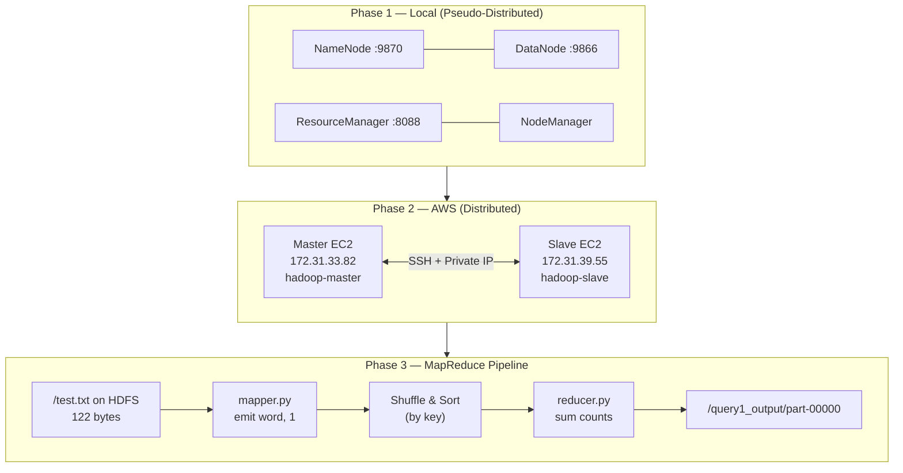

**How Hadoop fits together (simple version):**

- **NameNode** — keeps track of where files and blocks live (metadata brain)
- **DataNode** — stores the actual data blocks on disk
- **ResourceManager** — decides which node runs your job
- **NodeManager** — runs the map/reduce tasks on each machine
- **MapReduce** — splits work: Map (transform) → Shuffle/Sort (group by key) → Reduce (aggregate)

---

## Tech Stack

| Tool | Version / Detail |
|------|------------------|
| Apache Hadoop | 3.3.6 |
| Java | OpenJDK 8 |
| Python | 3 (mapper & reducer via Streaming API) |
| OS (local) | Linux — hostname `bolt.taha` |
| OS (cloud) | Ubuntu 24.04 LTS on AWS |
| Cloud | EC2 `m7i-flex.large`, region `ap-south-1` (Mumbai) |
| Hadoop user | `hadoop` (local) / `hdoop` (AWS) |

---

## Phase 1 — Single-Node Hadoop Setup

I started with a pseudo-distributed cluster — all Hadoop daemons on one machine, but communicating as if they were separate nodes. This is the right first step before going multi-node.

### Step 1 — Install dependencies

```bash
sudo apt update
sudo apt install openjdk-8-jdk

# Create a dedicated Hadoop user (do not run Hadoop as root)
sudo adduser hadoop
su - hadoop
```

### Step 2 — SSH setup (required even on single node)

Hadoop uses SSH to start daemons on itself. Set up passwordless login:

```bash
ssh-keygen -t rsa
cat ~/.ssh/id_rsa.pub >> ~/.ssh/authorized_keys
chmod 0600 ~/.ssh/authorized_keys
```

### Step 3 — Download and extract Hadoop

```bash
wget https://dlcdn.apache.org/hadoop/common/hadoop-3.3.6/hadoop-3.3.6.tar.gz
tar xzf hadoop-3.3.6.tar.gz
```

### Step 4 — Environment variables (`~/.bashrc`)

Add these lines to the end of your `~/.bashrc`, then run `source ~/.bashrc`:

```bash
export HADOOP_HOME=/home/hadoop/hadoop-3.3.6
export HADOOP_INSTALL=$HADOOP_HOME
export HADOOP_MAPRED_HOME=$HADOOP_HOME
export HADOOP_COMMON_HOME=$HADOOP_HOME
export HADOOP_HDFS_HOME=$HADOOP_HOME
export YARN_HOME=$HADOOP_HOME
export HADOOP_COMMON_LIB_NATIVE_DIR=$HADOOP_HOME/lib/native
export PATH=$PATH:$HADOOP_HOME/sbin:$HADOOP_HOME/bin
export HADOOP_OPTS="-Djava.library.path=$HADOOP_HOME/lib/native"
```

### Step 5 — Java home (`hadoop-env.sh`)

```bash
# Find your Java path
readlink -f /usr/bin/javac   # e.g. /usr/lib/jvm/java-8-openjdk-amd64/bin/javac

# Edit hadoop-env.sh
nano ~/hadoop-3.3.6/etc/hadoop/hadoop-env.sh
```

```bash
export JAVA_HOME=/usr/lib/jvm/java-8-openjdk-amd64
```

### Step 6 — Core configuration files

Create storage directories first:

```bash
mkdir -p ~/hadoop-3.3.6/tmpdata
mkdir -p ~/hadoop-3.3.6/dfsdata/namenode
mkdir -p ~/hadoop-3.3.6/dfsdata/datanode
```

**`core-site.xml`**

```xml
<configuration>
  <property>
    <name>hadoop.tmp.dir</name>
    <value>/home/hadoop/hadoop-3.3.6/tmpdata</value>
  </property>
  <property>
    <name>fs.defaultFS</name>
    <value>hdfs://127.0.0.1:9000</value>
  </property>
</configuration>
```

**`hdfs-site.xml`**

```xml
<configuration>
  <property>
    <name>dfs.namenode.name.dir</name>
    <value>/home/hadoop/hadoop-3.3.6/dfsdata/namenode</value>
  </property>
  <property>
    <name>dfs.datanode.data.dir</name>
    <value>/home/hadoop/hadoop-3.3.6/dfsdata/datanode</value>
  </property>
  <property>
    <name>dfs.replication</name>
    <value>1</value>
  </property>
</configuration>
```

**`mapred-site.xml`**

```xml
<configuration>
  <property>
    <name>mapreduce.framework.name</name>
    <value>yarn</value>
  </property>
</configuration>
```

**`yarn-site.xml`**

```xml
<configuration>
  <property>
    <name>yarn.nodemanager.aux-services</name>
    <value>mapreduce_shuffle</value>
  </property>
  <property>
    <name>yarn.nodemanager.aux-services.mapreduce.shuffle.class</name>
    <value>org.apache.hadoop.mapred.ShuffleHandler</value>
  </property>
</configuration>
```

### Step 7 — Format HDFS and start daemons

```bash
# Format only once — on a fresh install
hdfs namenode -format

# Start everything
start-all.sh

# Verify — you should see all five processes
jps
```

**Expected `jps` output on a healthy single-node cluster:**

```
NameNode
DataNode
SecondaryNameNode
ResourceManager
NodeManager
Jps
```

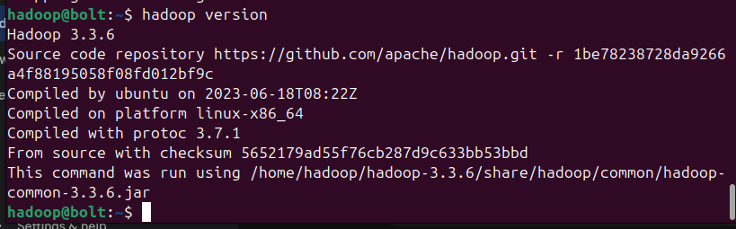

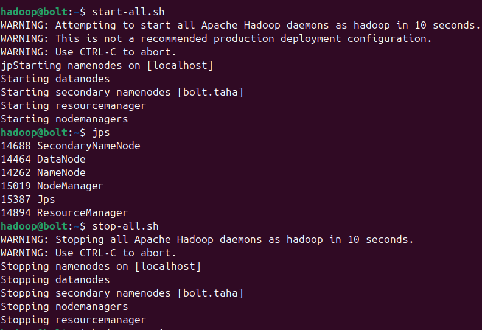

---

## Phase 2 — HDFS Administration & Cluster Health

Once the cluster is running, I learned how to manage data on HDFS and read cluster health reports. This is the day-to-day ops side of Hadoop.

### Create your own directory space

```bash
hdfs dfs -mkdir /usr/$(whoami)
hdfs dfs -ls /usr
```

A typical listing looks like:

```
drwxr-xr-x   - hadoop hadoop   0  /usr/hadoop
```

**Understanding permissions:** `drwxr-xr-x` breaks down as:
- `d` — directory
- `rwx` — owner (you) can read, write, execute
- `r-x` — group can read and execute
- `r-x` — others can read and execute

To restrict access so only you can touch your data:

```bash
hdfs dfs -chmod -R 700 /usr/hadoop
```

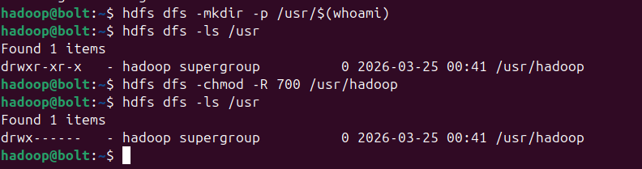

### Cluster health commands

These three commands tell you almost everything about your cluster:

```bash
hdfs dfsadmin -printTopology   # which datanodes exist and where
hdfs dfsadmin -report          # capacity, usage, live nodes
hdfs fsck /                    # filesystem integrity check
```

**My local cluster snapshot:**

| Metric | Value |
|--------|-------|
| Live DataNodes | 1 |
| DataNode address | `127.0.0.1:9866` (localhost) |
| Hostname | `bolt.taha` |
| Configured capacity | 237,980,721,152 bytes (221.64 GB) |
| Present capacity | 145,545,338,880 bytes (135.55 GB) |
| DFS remaining | 135.55 GB (61.16%) |
| DFS used | 32 KB |
| Default replication factor | 1 |
| Filesystem status | **HEALTHY** |
| Under-replicated blocks | 0 |
| Missing blocks | 0 |
| Corrupt blocks | 0 |

**What I learned here:** "Configured capacity" is the total disk Hadoop sees. "Present capacity" is what is actually available after the OS and other apps use space. On my machine, ~74 GB was used by non-HDFS processes.

---

## Phase 3 — Multi-Node Cluster on AWS

I did not have a second physical machine, so I provisioned two EC2 instances in AWS Mumbai (`ap-south-1`). This was the hardest part of the project — not Hadoop itself, but getting two cloud VMs to trust each other.

### Infrastructure

| Node | Private IP | Public IP | Hostname | Processes (`jps`) |
|------|-----------|-----------|----------|-------------------|
| Master | `172.31.33.82` | `43.204.19.113` | `hadoop-master` | NameNode, SecondaryNameNode, ResourceManager |
| Slave | `172.31.39.55` | `13.233.x.x` | `hadoop-slave` | DataNode, NodeManager |

Instance type: `m7i-flex.large` · OS: Ubuntu 24.04 LTS · User: `hdoop`

### Phase 3.1 — AWS Security Groups

AWS blocks all traffic between instances by default. My first attempt failed because the nodes could not reach each other.

| Problem | What happened | Fix |
|---------|---------------|-----|
| Nodes invisible to each other | Default SG allows nothing internally | Added a **self-referencing rule** on `sg-09707f49c49aa2a50` — All TCP from the same security group |
| AWS console error | *"You may not specify a referenced group id for an existing IPv4 CIDR rule"* | Cannot mix CIDR (`0.0.0.0/0`) and Security Group ID in one rule — create a separate inbound rule for the SG reference |

### Phase 3.2 — SSH Authentication

Passwordless SSH between master and slave is required for Hadoop to start remote daemons.

| Problem | What happened | Fix |
|---------|---------------|-----|
| PEM key rejected locally | Permissions were `0664` (too open) | `chmod 400 taha-key.pem` |
| `Permission denied (publickey)` | Ubuntu 24.04 disables password auth by default | Edited SSH config on the slave |
| Settings not taking effect | `60-cloudimg-settings.conf` was overriding `sshd_config` | Edited the cloud-init override file, then `sudo systemctl restart sshd` |
| Master cannot reach slave | No trust established | `ssh-copy-id -i ~/.ssh/id_rsa.pub hdoop@hadoop-slave` |

### Phase 3.3 — Hostname mapping (`/etc/hosts`)

On **both** machines, map private IPs to hostnames so configs stay stable:

```bash
sudo nano /etc/hosts
```

```
172.31.33.82   hadoop-master
172.31.39.55   hadoop-slave
```

Always use **private IPs** inside the cluster — not public IPs. Public IPs change; private IPs stay consistent within the VPC.

### Phase 3.4 — Distributed Hadoop configuration

**Key change in `core-site.xml` (slave and master):**

```xml
<property>
  <name>fs.defaultFS</name>
  <value>hdfs://hadoop-master:9000</value>
</property>
<property>
  <name>dfs.permissions</name>
  <value>false</value>
</property>
```

**Storage directories on AWS:**

```bash
mkdir -p /home/hdoop/hadoop-3.3.6/tmpdata
mkdir -p /home/hdoop/hadoop-3.3.6/dfsdata/namenode
mkdir -p /home/hdoop/hadoop-3.3.6/dfsdata/datanode
```

**Sync configs from master to slave** (so both nodes match):

```bash
scp -r ~/hadoop-3.3.6/etc/hadoop/ hdoop@hadoop-slave:~/hadoop-3.3.6/etc/
```

### Phase 3.5 — Start and verify

```bash
# On master only — format once
hdfs namenode -format

# On master
start-dfs.sh
start-yarn.sh

# On slave — start datanode and nodemanager
hadoop-daemon.sh start datanode
yarn-daemon.sh start nodemanager

# Verify on master
jps
hdfs dfsadmin -report
```

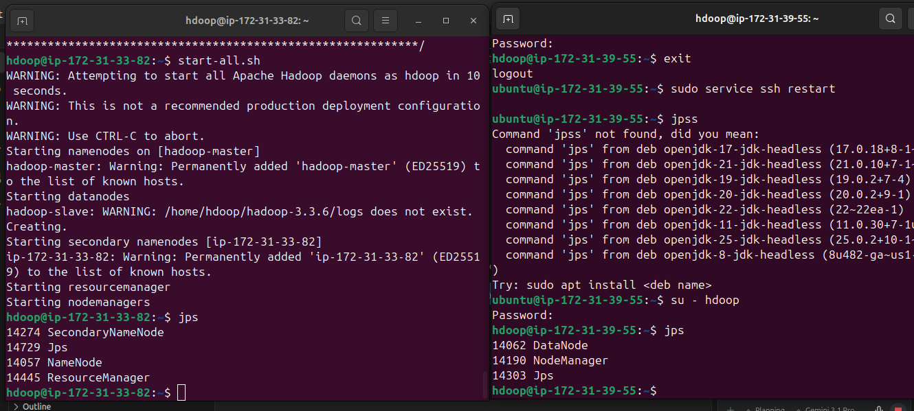

**Verified distributed result:**

| Metric | Value |
|--------|-------|
| Live DataNodes | 1 |
| DataNode | `172.31.39.55:9866 (hadoop-slave)` |
| Configured capacity | 24,883,167,232 bytes (23.17 GB) |
| Present capacity | 19,697,930,240 bytes (18.35 GB) |
| DFS remaining | 79.16% |
| Status | Slave reporting storage to master across the network |

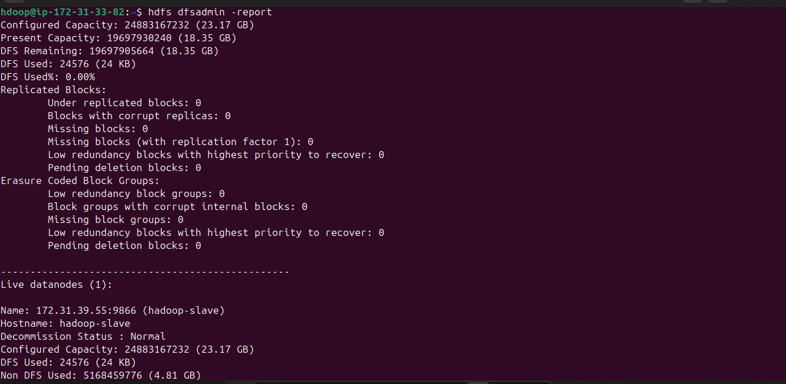

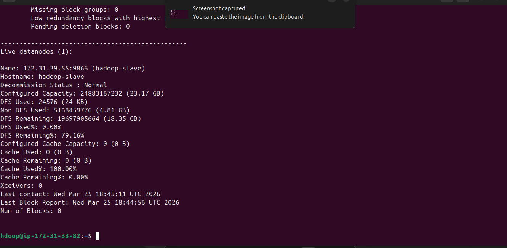

---

## Phase 4 — MapReduce Word Count (Python Streaming)

Hadoop is written in Java, but you do not have to write Java to use it. **Hadoop Streaming** lets you pipe `stdin`/`stdout` through any executable — I used Python.

### The pipeline (step by step)

```
test.txt (local)
    ↓  hdfs dfs -put
/test.txt (HDFS, 122 bytes)
    ↓  Map phase — mapper.py reads lines, emits (word, 1)
Shuffle & Sort — Hadoop groups identical keys together
    ↓  Reduce phase — reducer.py sums values per key
/query1_output/part-00000 (HDFS result)
```

### Step 1 — Switch to the Hadoop user

```bash
su - hadoop
```

Hadoop expects its own user with correct SSH keys and directory ownership. Running as your normal user caused permission issues for me.

### Step 2 — Create and upload input data

```bash
nano test.txt   # comma-separated words (see scripts/test.txt)
hdfs dfs -put test.txt /test.txt
hdfs dfs -ls /test.txt
```

**My first mistake:** I tried `hdfs dfs -put` before starting daemons and got:

```
Connection refused: Call From bolt.taha/127.0.1.1 to localhost:9000 failed
```

**Fix:** run `start-all.sh` first, confirm with `jps`, then upload.

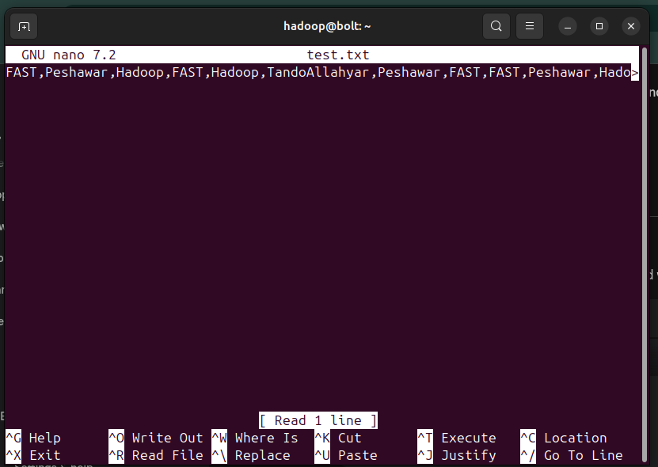

### Step 3 — Inspect file health on HDFS

```bash
hdfs fsck /test.txt -files -blocks -locations
```

**What this told me about my file:**

| Property | Value |
|----------|-------|
| File size | 122 bytes |
| Blocks used | 1 |
| Default block size | 128 MB (134,217,728 bytes) |
| Replication factor | 1 |
| Missing replicas | 0 |
| Status | HEALTHY |

**Key insight:** even though my file was only 122 bytes, HDFS still allocated a full block metadata entry at the default 128 MB block size. The actual disk used is tiny — the block size is just the upper limit per chunk.

To upload with a custom block size (e.g. 1 MB):

```bash
hdfs dfs -Ddfs.blocksize=1048576 -put test.txt /test_small.txt
# 1048576 bytes = 1 MB — file still fits in 1 block since 122 < 1,048,576
```

**Why missing replicas happen:** on a single-node setup with replication factor 3, Hadoop wants 3 copies on 3 different DataNodes. It only finds one, so it reports 2 as "missing." This is expected — not a bug.

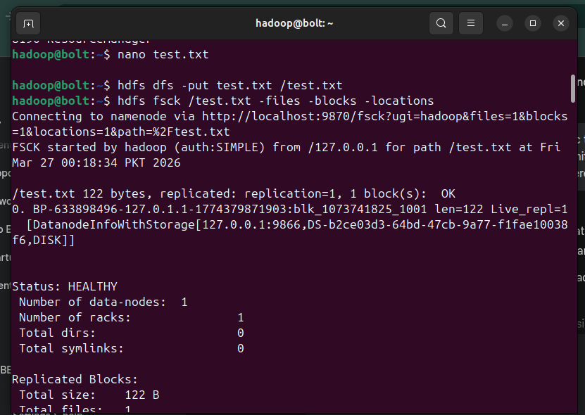

### Step 4 — Mapper and Reducer scripts

The scripts are in `scripts/`. Here is what each one does:

**`mapper.py`** — reads lines from stdin, splits by comma, emits `word\t1`:

```python
#!/usr/bin/env python3
import sys
for line in sys.stdin:
    data = line.strip().split(",")
    key = data[0]
    value = 1
    print("{0}\t{1}".format(key, value))
```

**`reducer.py`** — receives sorted key-value pairs, sums counts per key:

```python
#!/usr/bin/env python3
import sys
total = 0
oldkey = None
for line in sys.stdin:
    data = line.strip().split("\t")
    thiskey = data[0]
    value = data[1]
    if thiskey != oldkey and oldkey is not None:
        print("{0}\t{1}".format(oldkey, total))
        oldkey = thiskey
        total = 0
    oldkey = thiskey
    total += float(value)
if oldkey is not None:
    print("{0}\t{1}".format(oldkey, total))
```

Make them executable and **test locally before submitting to Hadoop**:

```bash
chmod u+x mapper.py reducer.py
cat test.txt | ./mapper.py | sort | ./reducer.py
```

Local test output:

```
FAST            6.0
Hadoop          4.0
Peshawar        4.0
TandoAllahyar   2.0
```

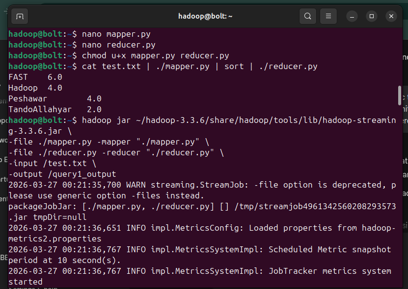

### Step 5 — Submit the MapReduce job

```bash
hadoop jar ~/hadoop-3.3.6/share/hadoop/tools/lib/hadoop-streaming-3.3.6.jar \
  -files ./mapper.py,./reducer.py \
  -mapper "./mapper.py" \
  -reducer "./reducer.py" \
  -input /test.txt \
  -output /query1_output
```

**What happens inside the job:**

1. **Map** — mapper reads `/test.txt` from HDFS, outputs 16 key-value records
2. **Shuffle & Sort** — Hadoop automatically sorts by key so all identical words go to the same reducer
3. **Reduce** — reducer sums values and writes result to HDFS

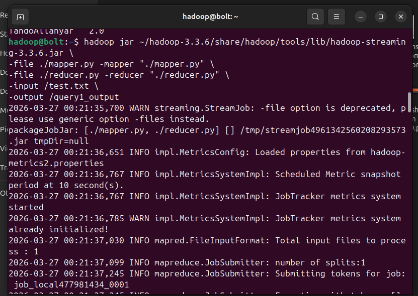

### Step 6 — Read the output

```bash
hdfs dfs -cat /query1_output/part-00000
```

```
FAST            6.0
Hadoop          4.0
Peshawar        4.0
TandoAllahyar   2.0
```

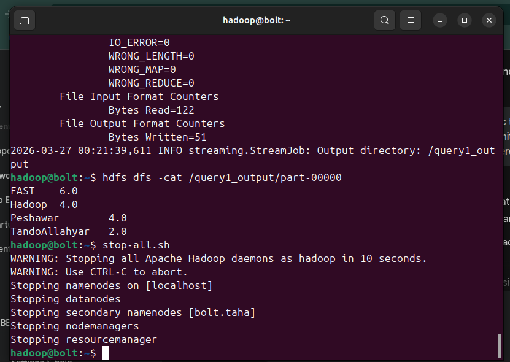

### Job metrics (from my run)

| Metric | Value | Notes |
|--------|-------|-------|
| Key-value type | `<String, Float>` | Word = key, count = value |
| Mapper tasks | 1 | Input fits in one HDFS block → one split |
| Reducer tasks | 1 | Default for single output |
| Map input records | 1 | One line in test.txt |
| Map output records | 16 | 16 comma-separated tokens |
| Reduce output records | 4 | 4 unique words |
| Map phase time | ~148 ms | |
| Reduce phase time | ~645 ms | |
| Output file | `/query1_output/part-00000` | |
| Shuffle errors | 0 | All clean |

### Shut down when done

```bash
stop-all.sh
```

---

## Troubleshooting Guide

Problems I actually hit — and how I fixed them:

| Error | Cause | Solution |
|-------|-------|----------|
| `Connection refused` on port 9000 | Hadoop daemons not running | `start-all.sh` → verify with `jps` |
| `[200~start-all.sh~: command not found` | Terminal paste corruption | Type the command manually |
| `Permission denied (publickey)` | SSH keys not set up between nodes | `ssh-copy-id`, check `authorized_keys` |
| PEM key "permissions too open" | Key file mode is 0664 | `chmod 400 your-key.pem` |
| SSH config changes ignored | Ubuntu cloud-init override | Edit `/etc/ssh/sshd_config.d/60-cloudimg-settings.conf` |
| AWS nodes cannot communicate | Security group blocks internal traffic | Self-referencing SG inbound rule |
| `fsck` shows missing replicas | Replication factor > number of DataNodes | Expected on single-node; lower `dfs.replication` or add nodes |
| `-file option is deprecated` | Old Streaming API flag | Use `-files` instead of `-file` |

---

## Full Implementation Guide

Follow this order if you want to reproduce the entire project from zero.

### A. Local single-node (start here)

```bash
# 1. Install Java + create hadoop user
sudo apt update && sudo apt install openjdk-8-jdk
sudo adduser hadoop && su - hadoop

# 2. SSH + download Hadoop
ssh-keygen -t rsa -N "" -f ~/.ssh/id_rsa
cat ~/.ssh/id_rsa.pub >> ~/.ssh/authorized_keys
chmod 0600 ~/.ssh/authorized_keys
wget https://dlcdn.apache.org/hadoop/common/hadoop-3.3.6/hadoop-3.3.6.tar.gz
tar xzf hadoop-3.3.6.tar.gz

# 3. Set env vars (add to ~/.bashrc, then source it)
# 4. Configure XML files (see Phase 1 above)
# 5. Create dirs, format, start
mkdir -p ~/hadoop-3.3.6/{tmpdata,dfsdata/namenode,dfsdata/datanode}
hdfs namenode -format
start-all.sh && jps

# 6. HDFS basics
hdfs dfs -mkdir /usr/$(whoami)
hdfs dfs -chmod -R 700 /usr/$(whoami)
hdfs dfsadmin -report
```

### B. MapReduce word count

```bash
# Copy scripts from this repo
cp scripts/test.txt scripts/mapper.py scripts/reducer.py ~/
chmod u+x ~/mapper.py ~/reducer.py

# Test locally first
cat ~/test.txt | ~/mapper.py | sort | ~/reducer.py

# Upload and run on Hadoop
hdfs dfs -put ~/test.txt /test.txt
hadoop jar $HADOOP_HOME/share/hadoop/tools/lib/hadoop-streaming-3.3.6.jar \
  -files ~/mapper.py,~/reducer.py \
  -mapper "./mapper.py" -reducer "./reducer.py" \
  -input /test.txt -output /wordcount_output

hdfs dfs -cat /wordcount_output/part-00000
```

### C. AWS multi-node (advanced)

1. Launch 2× EC2 Ubuntu 24.04 in the same VPC/subnet
2. Configure security group — self-referencing All TCP rule
3. Set up `/etc/hosts` on both machines with private IPs
4. Install Hadoop on both (same steps as local)
5. `ssh-copy-id` from master to slave
6. Point `fs.defaultFS` to `hdfs://hadoop-master:9000`
7. `scp` configs from master to slave
8. Format HDFS on master, start daemons, verify with `hdfs dfsadmin -report`

---

## Repository Structure

```
.
├── README.md                         # This file
├── images/                           # Screenshots (proof of each phase)
│   ├── single-node-install-1.png
│   ├── single-node-install-2.png
│   ├── hdfs-directory-permissions.png
│   ├── multi-node-jps.png
│   ├── dfsadmin-report-1.png
│   ├── dfsadmin-report-2.png
│   ├── wordcount-test-file.png
│   ├── hdfs-upload-and-fsck.png
│   ├── mapper-reducer-scripts.png
│   ├── mapreduce-job-execution.png
│   └── wordcount-final-output.png
├── scripts/
│   ├── mapper.py                     # Map phase script
│   ├── reducer.py                    # Reduce phase script
│   └── test.txt                      # Sample input data
├── docs/
│   ├── technical-report.pdf          # Full write-up with terminal logs
│   └── technical-report.tex          # LaTeX source
└── .gitignore
```

---

## Skills Demonstrated

| Area | What this project shows |
|------|------------------------|
| **HDFS** | Install, format, permissions, fsck, block/replica inspection |
| **YARN** | Resource manager configuration and job scheduling |
| **MapReduce** | Python Streaming — map, shuffle, reduce pipeline |
| **Cloud (AWS)** | EC2 provisioning, security groups, VPC private networking |
| **Linux** | SSH hardening, `/etc/hosts`, file permissions, daemon management |
| **Debugging** | Real errors documented with root cause and fix |
| **Documentation** | Reproducible commands, config snippets, visual proof |

---

## About

**Muhammad Taha**  
Big Data · Distributed Systems · Cloud Infrastructure

I built this project to understand Hadoop properly — not just pass a checklist. The AWS multi-node setup taught me more about networking and SSH than any lecture did. I still have a lot to learn (Spark, Hive, production-grade replication), but this is a solid foundation I am proud to share.

For the full technical report with complete terminal logs, see [`docs/technical-report.pdf`](docs/technical-report.pdf).

---

## License

Shared for portfolio and learning purposes. Feel free to use this as a reference for your own setup.
